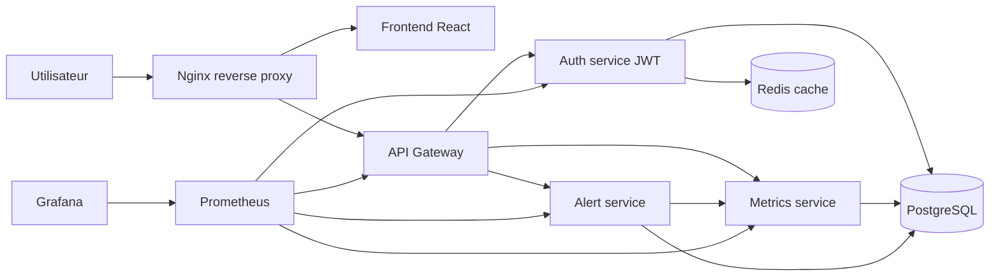

# GreenOps Platform

GreenOps Platform est une plateforme SaaS de supervision energetique construite en microservices. Le projet couvre les deux phases du cahier des charges : infrastructure Docker Compose puis migration Kubernetes avec observabilite, resilience et CI/CD.

## Architecture



Services principaux :

| Service | Role | Port interne |
| --- | --- | --- |
| frontend | Dashboard React GreenOps | 80 |
| nginx | Reverse proxy public | 80 |
| api-gateway | Routage `/api`, aggregation health | 3000 |
| auth-service | JWT, utilisateurs, roles, cache Redis | 3001 |
| metrics-service | Mesures energetiques, historique, exposition Prometheus | 3003 |
| alert-service | Evaluation des seuils et historique d'alertes | 3004 |
| postgres | Persistance utilisateurs, metriques, alertes | 5432 |
| redis | Cache applicatif | 6379 |
| prometheus | Scraping metriques | 9090 |
| grafana | Visualisation monitoring | 3000 |

## Demarrage Docker

```bash
cp .env.example .env
docker compose up --build
```

Acces locaux :

| Interface | URL |
| --- | --- |
| Application | http://localhost:8080 |
| Prometheus | http://localhost:9090 |
| Grafana | http://localhost:3002 |

Compte de demonstration :

| Email | Mot de passe | Role |
| --- | --- | --- |
| `admin@greenops.local` | `Admin123!` | `admin` |

## Commandes utiles

```bash
npm run check
npm run lint
npm run build
docker compose config
docker compose build
```

## Kubernetes

Les manifests sont dans `kubernetes/base` et incluent Namespace, ConfigMaps, Secret modele, Deployments, Services, PVC, Ingress, probes et HPA.

```bash
docker build -t greenops/frontend:latest frontend
docker build -t greenops/api-gateway:latest services/api-gateway
docker build -t greenops/auth-service:latest services/auth-service
docker build -t greenops/metrics-service:latest services/metrics-service
docker build -t greenops/alert-service:latest services/alert-service

kubectl apply -k kubernetes/base
kubectl -n greenops get pods
```

Pour l'Ingress local :

```bash
echo "127.0.0.1 greenops.local" | sudo tee -a /etc/hosts
```

Voir [docs/kubernetes.md](docs/kubernetes.md) pour les procedures de scaling, resilience et supervision.

## Documentation

- [Architecture technique](docs/architecture.md)
- [Procedure Docker](docs/docker.md)
- [Procedure Kubernetes](docs/kubernetes.md)
- [API applicative](docs/api.md)
- [Securite](docs/security.md)
- [Support de soutenance](docs/soutenance.md)

## CI/CD

GitHub Actions execute :

- installation des dependances frontend et microservices ;
- verification syntaxique backend ;
- lint et build React ;
- validation Docker Compose ;
- build des images Docker applicatives.

Workflow : `.github/workflows/ci.yml`.
