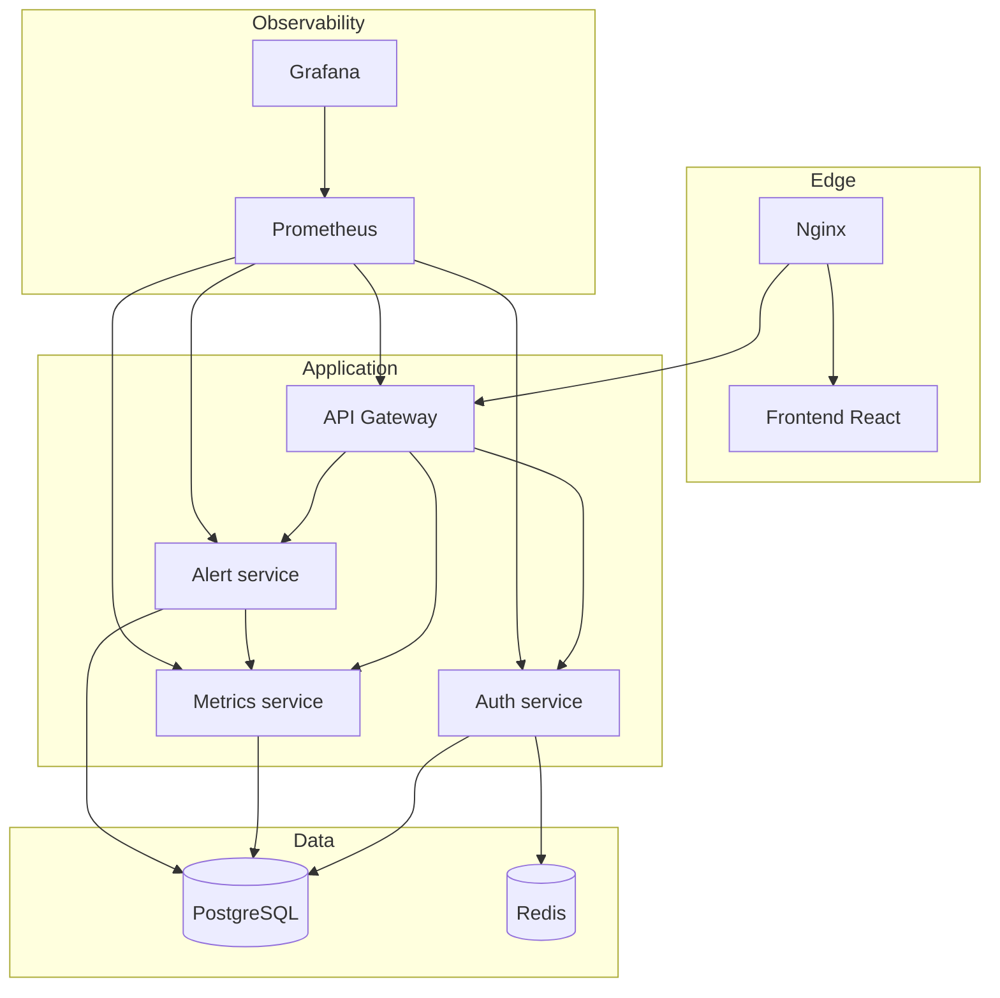

# Architecture Technique

## Vue d'ensemble

GreenOps Platform applique une architecture microservices separee en quatre blocs :

- exposition : Nginx et frontend React ;
- orchestration applicative : API Gateway ;
- domaine metier : auth-service, metrics-service, alert-service ;
- donnees et observabilite : PostgreSQL, Redis, Prometheus, Grafana.

## Choix techniques

Node.js + Express a ete retenu pour les microservices afin de garder des services legers, faciles a conteneuriser et rapides a verifier en CI.

React + Vite fournit une interface moderne avec un build statique servi par Nginx.

PostgreSQL assure la persistance des utilisateurs, mesures energetiques et alertes.

Redis sert de cache applicatif pour les listes d'utilisateurs dans le service d'authentification.

Prometheus collecte les metriques applicatives exposees par chaque service via `/metrics`. Grafana se connecte a Prometheus pour construire les tableaux de bord.

## Flux principaux

1. Le navigateur charge le frontend via Nginx.
2. Le frontend appelle `/api/...`, route par Nginx vers l'API Gateway.
3. L'API Gateway transmet aux microservices internes.
4. Les services metiers lisent/ecrivent dans PostgreSQL.
5. Prometheus scrappe API Gateway, Auth, Metrics et Alert.
6. Grafana lit Prometheus.

## Reseaux Docker

Le `docker-compose.yml` segmente les communications :

| Reseau | Services | Objectif |
| --- | --- | --- |
| edge | nginx | point d'entree public |
| app | nginx, frontend, gateway, microservices, prometheus | trafic applicatif interne |
| data | postgres, redis, services metiers | stockage isole, reseau interne |
| observability | prometheus, grafana | supervision |

## Objets Kubernetes

Les manifests couvrent :

- `Namespace` pour isoler la plateforme ;
- `ConfigMap` pour la configuration non sensible ;
- `Secret` modele pour les valeurs sensibles ;
- `PersistentVolumeClaim` pour PostgreSQL et Grafana ;
- `Deployment` et `Service` pour chaque composant ;
- `Ingress` pour exposer `/` et `/api` ;
- `HorizontalPodAutoscaler` pour gateway et microservices ;
- probes `readiness` et `liveness` pour la resilience.
