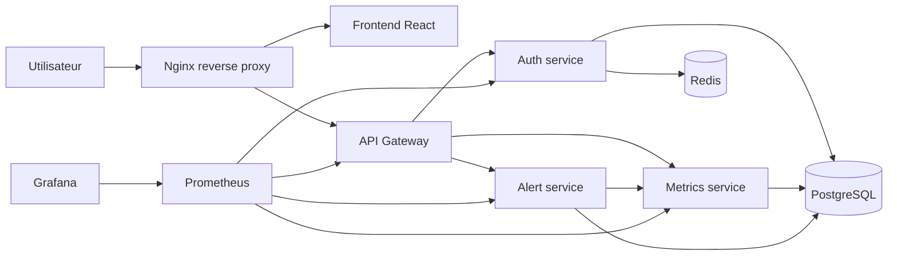

# Support de Soutenance

Ce document sert de fil conducteur pour presenter le projet GreenOps Platform devant le jury. Il est structure pour montrer la comprehension du cahier des charges, les choix techniques, la demonstration Docker, la migration Kubernetes, l'observabilite, la securite et les points de validation.

## 1. Introduction

GreenOps Platform est une plateforme SaaS de supervision energetique. L'objectif est de suivre des mesures de consommation, d'evaluer des seuils d'alerte et de superviser l'etat technique de l'application.

Le projet repond aux deux axes du cahier des charges :

- conteneurisation complete avec Docker et Docker Compose ;
- preparation de la migration Kubernetes avec manifests, services, stockage, probes, HPA et Ingress.

L'application est volontairement decoupee en microservices afin de demontrer les notions de reseau, persistance, securite, orchestration et observabilite.

## 2. Architecture generale



Le frontend ne contacte pas directement les microservices. Il passe par Nginx, puis par l'API Gateway. L'API Gateway centralise les routes publiques `/api`, simplifie le frontend et masque les ports internes.

PostgreSQL conserve les utilisateurs, les mesures energetiques et les alertes. Redis sert au cache applicatif du service d'authentification.

Prometheus collecte les metriques exposees par chaque service Node.js, puis Grafana les affiche dans un dashboard dedie.

## 3. Services presentes

| Service | Technologie | Role |
| --- | --- | --- |
| `frontend` | React + Vite + Nginx | Interface utilisateur GreenOps |
| `nginx` | Nginx Alpine | Reverse proxy public |
| `api-gateway` | Node.js Express | Point d'entree API et health global |
| `auth-service` | Node.js Express | Authentification JWT, roles, cache Redis |
| `metrics-service` | Node.js Express | Mesures energetiques, resume, live metrics |
| `alert-service` | Node.js Express | Evaluation des seuils et historique d'alertes |
| `postgres` | PostgreSQL 17 | Base relationnelle persistante |
| `redis` | Redis 8 | Cache |
| `prometheus` | Prometheus | Collecte des metriques |
| `grafana` | Grafana | Visualisation des metriques |

## 4. Choix techniques a expliquer

### Docker Compose

Docker Compose orchestre tous les conteneurs localement. Il permet de declarer :

- les images ;
- les builds applicatifs ;
- les variables d'environnement ;
- les volumes persistants ;
- les reseaux ;
- les healthchecks ;
- les dependances entre services.

Le projet utilise plusieurs reseaux :

| Reseau | Usage |
| --- | --- |
| `edge` | exposition publique via Nginx |
| `app` | communication entre frontend, gateway et microservices |
| `data` | PostgreSQL et Redis, en reseau interne |
| `observability` | communication Grafana/Prometheus |

Le reseau `data` est marque `internal`, ce qui limite l'exposition de PostgreSQL et Redis.

### API Gateway

L'API Gateway evite d'exposer directement les microservices. Elle fournit :

- un point d'entree unique pour le frontend ;
- un endpoint `/api/platform/health` pour verifier les services ;
- une couche de routage claire vers auth, metrics et alerts ;
- une metrique Prometheus `greenops_gateway_http_requests_total`.

### JWT et roles

Le service d'authentification genere un token JWT apres connexion. Ce token est ensuite utilise pour acceder aux routes protegees comme le profil utilisateur.

Le compte de demonstration est :

| Email | Mot de passe | Role |
| --- | --- | --- |
| `admin@greenops.local` | `Admin123!` | `admin` |

### Persistance

PostgreSQL est utilise pour les donnees durables :

- table `users` ;
- table `energy_metrics` ;
- table `alerts`.

Les donnees sont conservees grace au volume Docker `postgres_data`.

Redis sert de cache et utilise le volume `redis_data`.

## 5. Demonstration Docker

### 5.1 Lancement

Depuis la racine du projet :

```bash
cp .env.example .env
docker compose up --build
```

Sur cette machine, les ports par defaut etaient deja occupes. Les ports de validation locale sont donc :

| Interface | URL |
| --- | --- |
| Application | http://localhost:8081 |
| Prometheus | http://localhost:9091 |
| Grafana | http://localhost:3006 |

Les ports par defaut du projet restent :

| Interface | URL |
| --- | --- |
| Application | http://localhost:8080 |
| Prometheus | http://localhost:9090 |
| Grafana | http://localhost:3002 |

Pour verifier les ports reels exposes :

```bash
docker compose ps
```

### 5.2 Verification technique

Commandes a montrer :

```bash
docker compose ps
curl http://localhost:8081/gateway-health
curl http://localhost:8081/api/platform/health
curl http://localhost:8081/api/energy/summary
curl http://localhost:9091/-/healthy
curl http://localhost:3006/api/health
```

Resultat attendu :

- les conteneurs applicatifs sont `Up` ;
- les services critiques sont `healthy` ;
- l'API Gateway retourne `UP` ;
- Prometheus retourne `Prometheus Server is Healthy` ;
- Grafana retourne une reponse JSON avec la base de donnees `ok`.

### 5.3 Scenario utilisateur

1. Ouvrir l'application.
2. Se connecter avec `admin@greenops.local` / `Admin123!`.
3. Montrer les KPI energie : puissance, renouvelable, carbone, pic.
4. Montrer la courbe de consommation.
5. Montrer l'etat des microservices.
6. Cliquer sur `Actualiser`.
7. Cliquer sur `Evaluer` pour lancer l'evaluation des seuils.
8. Montrer l'historique des alertes.
9. Ouvrir Prometheus depuis le bloc `Observabilite`.
10. Ouvrir Grafana depuis le bloc `Observabilite`.

## 6. Demonstration Prometheus

Prometheus collecte les metriques exposees par :

| Job | Endpoint interne |
| --- | --- |
| `api-gateway` | `api-gateway:3000/metrics` |
| `auth-service` | `auth-service:3001/metrics` |
| `metrics-service` | `metrics-service:3003/metrics` |
| `alert-service` | `alert-service:3004/metrics` |
| `prometheus` | `prometheus:9090` |

Dans Prometheus, montrer :

1. `Status > Target health` pour prouver que les services sont scrapes.
2. La requete :

```promql
up
```

3. La requete :

```promql
greenops_gateway_http_requests_total
```

4. Une metrique Node.js standard :

```promql
process_resident_memory_bytes
```

Message a expliquer :

Prometheus ne cree pas les metriques applicatives a notre place. Les services exposent `/metrics` avec `prom-client`, puis Prometheus vient les lire toutes les 10 secondes.

## 7. Demonstration Grafana

Grafana est provisionne automatiquement.

Fichiers concernes :

| Fichier | Role |
| --- | --- |
| `infrastructure/grafana/provisioning/datasources/prometheus.yml` | connexion a Prometheus |
| `infrastructure/grafana/provisioning/dashboards/dashboards.yml` | declaration du dossier de dashboards |
| `infrastructure/grafana/dashboards/greenops-overview.json` | dashboard GreenOps |

Dans Grafana :

1. Se connecter avec `admin` / `GreenOps2026!Secure` pour la demonstration locale.
2. Ouvrir le dossier `GreenOps`.
3. Ouvrir le dashboard `GreenOps Observability`.
4. Montrer les panels :

| Panel | Interet |
| --- | --- |
| Tuiles de disponibilite | montre l'etat de chaque service en un coup d'oeil |
| Trafic API par statut | montre les appels HTTP regroupes par statut |
| Memoire des microservices | montre l'utilisation memoire des services Node.js |
| CPU des microservices | montre l'activite CPU des services applicatifs |
| Duree de collecte Prometheus | montre que Prometheus collecte correctement les targets |

Point important :

Grafana ne collecte pas les metriques. Grafana interroge Prometheus. Prometheus est donc la source de donnees.

## 8. Demonstration Kubernetes

Les manifests sont dans `kubernetes/base`.

Ils couvrent :

- Namespace ;
- ConfigMaps ;
- Secret exemple ;
- Deployments ;
- Services ;
- PVC ;
- Ingress ;
- probes ;
- HPA.

Commandes a presenter :

```bash
kubectl apply -k kubernetes/base
kubectl -n greenops get pods
kubectl -n greenops get svc
kubectl -n greenops get ingress
kubectl -n greenops get hpa
```

Verification du rendu Kustomize :

```bash
kubectl kustomize kubernetes/base
```

### Probes

Les probes permettent a Kubernetes de savoir si un conteneur est pret ou s'il doit etre redemarre.

Exemple :

- readinessProbe : le service peut recevoir du trafic ;
- livenessProbe : le service est encore vivant.

### HPA

Le HPA permet d'ajuster automatiquement le nombre de replicas selon la charge CPU.

Commandes utiles :

```bash
kubectl -n greenops get hpa
kubectl -n greenops describe hpa api-gateway
```

### Resilience

Demonstration possible :

```bash
kubectl -n greenops delete pod -l app=api-gateway
kubectl -n greenops get pods -w
```

Message a expliquer :

Kubernetes recree le pod car l'etat desire declare dans le Deployment indique qu'un replica doit toujours etre disponible.

## 9. CI/CD GitHub Actions

Le workflow `.github/workflows/ci.yml` valide le projet a chaque push ou pull request.

Etapes principales :

| Etape | Objectif |
| --- | --- |
| Installation Node | recuperer les dependances |
| Backend syntax check | verifier les services Node.js |
| Frontend lint | controler la qualite React |
| Frontend build | verifier que l'application compile |
| Docker Compose config | valider le fichier Compose |
| Docker build | verifier que les images applicatives se construisent |

Ce workflow demontre que le depot est exploitable par une equipe et qu'une erreur simple est detectee avant livraison.

## 10. Securite

Points a presenter :

- `.env` n'est pas versionne ;
- `.env.example` fournit uniquement un modele ;
- JWT secret configurable ;
- mot de passe stocke avec hash bcrypt ;
- PostgreSQL et Redis ne sont pas exposes directement sur l'hote ;
- reseau `data` interne dans Docker Compose ;
- images Node lancees avec l'utilisateur non-root `node` ;
- Secret Kubernetes separe des ConfigMaps.

Limites a reconnaitre :

- les secrets de demonstration doivent etre changes en production ;
- il faudrait ajouter HTTPS/TLS en production ;
- il faudrait brancher un registre d'images pour une vraie livraison Kubernetes ;
- il faudrait ajouter des tests applicatifs automatises plus complets.

## 11. Correspondance cahier des charges

| Exigence | Implementation |
| --- | --- |
| Frontend React ou Vue | React + Vite dans `frontend` |
| API Gateway | `services/api-gateway` |
| Authentification JWT | `services/auth-service` |
| Roles utilisateurs | role `admin` et `user` |
| Services metiers | `metrics-service`, `alert-service` |
| Base relationnelle | PostgreSQL |
| Cache | Redis |
| Reverse proxy | Nginx |
| Dockerfile par service | present dans chaque service applicatif |
| Docker Compose | `docker-compose.yml` |
| Reseaux et volumes | `edge`, `app`, `data`, `observability`, volumes persistants |
| Observabilite | Prometheus + Grafana |
| Logs | logs Docker Compose disponibles par service |
| Kubernetes | manifests dans `kubernetes/base` |
| ConfigMaps et Secrets | presents dans les manifests |
| PVC | PostgreSQL, Redis, Grafana |
| Probes | readiness/liveness sur les services |
| HPA | manifests HPA |
| Ingress | `kubernetes/base/40-ingress.yaml` |
| CI/CD | GitHub Actions |
| Documentation | `README.md` et `docs/` |

## 12. Plan de presentation conseille

Pour une soutenance de 10 a 12 minutes :

| Temps | Sujet |
| --- | --- |
| 1 min | contexte GreenOps et objectifs |
| 2 min | architecture microservices |
| 2 min | Docker Compose, reseaux, volumes, healthchecks |
| 2 min | demonstration application |
| 2 min | Prometheus et Grafana |
| 2 min | Kubernetes, HPA, probes, Ingress |
| 1 min | CI/CD, securite, conclusion |

Pour une soutenance de 20 minutes :

| Temps | Sujet |
| --- | --- |
| 2 min | introduction et cahier des charges |
| 4 min | architecture et services |
| 4 min | demonstration Docker |
| 3 min | observabilite Prometheus/Grafana |
| 4 min | Kubernetes |
| 2 min | CI/CD et securite |
| 1 min | limites et ameliorations |

## 13. Questions probables du jury

### Pourquoi utiliser une API Gateway ?

Pour centraliser les appels publics, eviter d'exposer tous les microservices et simplifier le frontend.

### Pourquoi separer PostgreSQL et Redis ?

PostgreSQL stocke les donnees durables. Redis est utilise pour le cache et peut etre reconstruit sans perdre les donnees metier.

### Pourquoi Prometheus et Grafana ensemble ?

Prometheus collecte et stocke les series temporelles. Grafana sert a les visualiser dans des dashboards.

### A quoi servent les probes Kubernetes ?

Elles permettent a Kubernetes de savoir si un pod est pret a recevoir du trafic ou s'il doit etre redemarre.

### Que faut-il changer pour la production ?

Il faut remplacer les secrets, activer TLS, publier les images dans un registre, configurer un vrai Ingress Controller, ajouter des tests et surveiller les logs de maniere centralisee.

## 14. Commandes de secours

Voir les conteneurs :

```bash
docker compose ps
```

Voir les logs :

```bash
docker compose logs -f api-gateway
docker compose logs -f prometheus
docker compose logs -f grafana
```

Relancer uniquement l'observabilite :

```bash
docker compose up -d prometheus grafana
```

Relancer le frontend apres modification :

```bash
docker compose up -d --build frontend nginx
```

Nettoyer les volumes de demonstration :

```bash
docker compose down -v
docker compose up --build
```

## 15. Conclusion possible

GreenOps Platform montre une application microservices complete, conteneurisee, documentee et prete a etre migree vers Kubernetes. Le projet couvre le cycle attendu : developpement applicatif, orchestration Docker, persistance, securite, observabilite, resilience Kubernetes et CI/CD.

La partie Docker permet de lancer tout l'environnement localement. La partie Kubernetes montre comment transformer cette application en plateforme orchestrable, scalable et plus resiliente.
